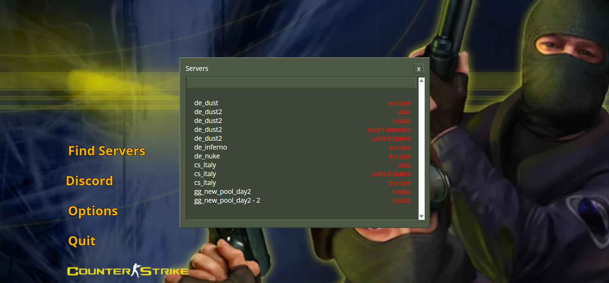

# Counster Strike 1.5/1.6/CS Source UI in the web

This project too about a week to make the in game
matches are hosted on play-cs.com this is kinda
just for more fun and to be more original
to the actual counter-strike menus you can fork
this repo if you want just please give credits to Lucky?🥞

# CS 1.5 Menu [COMING SOON]

# CS 1.6 Menu

# CS Source Menu [COMING SOON]

the counter-strike source and 1.5 menu css files were lost and i currently am remaking them
